
# Getting started with 3D fin to extract individual tree information from terrestrial point clouds

### Objectives of tutorial

- to understand the basic concepts of the 3D Fin workflow
- learn how to apply the 3D Fin software to extract individual trees from a 3D point-cloud
- ...

### Requirements to run this tutorial
To run this tutorial you will need a version of CloudCompare with the 3D Fin plug-in installed. You can download a zip-file containing a running version for Windows here:

You will furthermore need an example dataset. In our case we will use a terrestrial laserscan from a pine stand (*Pinus sylvestris*) in a forest in Brandenburg, Germany.

The dataset can be downloaded here:

### Starting 3D-Fin in CloudCompare

**Download the zip-folder, unpack it onto a folder** on your computer which you are able to find again and then **run CloudCompare by double-blicking the "CloudCompare.exe"** in the main file folder.

This should lead to a situation as shown in Figure 1.

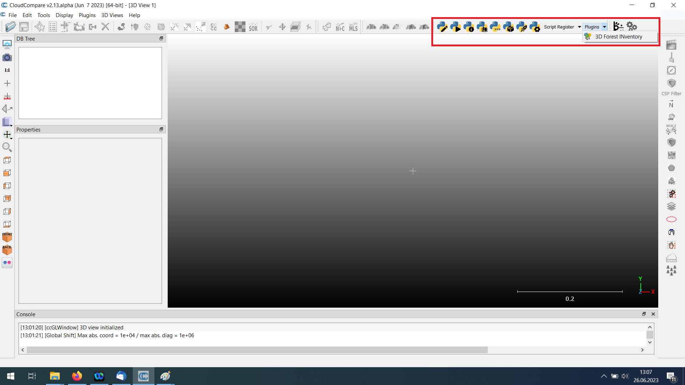

Your actual view is likely to appear a bit different since you might have other and additional toolbars activated. You might actually have to press on a little arrow-button on the top right of the menu bar to be able to see the relevant icons which are marked in Figure 1.

We are now ready to open our example dataset and start working with the 3D Fin plugin. To open the dataset, we select **File => Open**  (Figure 2) and then in the appearing new window browse to the ***pointcloud_plot5_30x30.las*** file, select it and press **"Open"**.

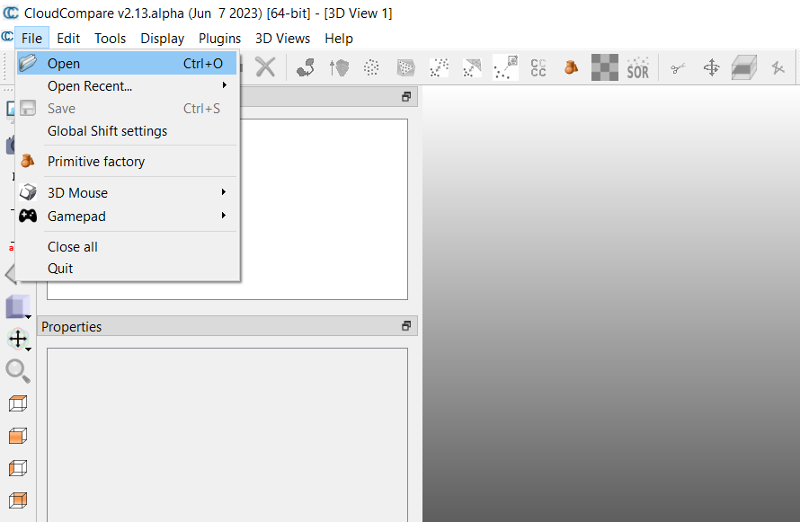

In the then appearing dialogue we use the standard settings to open the file. That is, in the first window we press **"Apply All"** (Figure 3) and in the second window **"Yes to All"** (Figure 4).

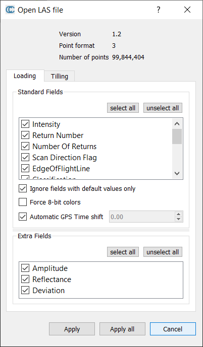
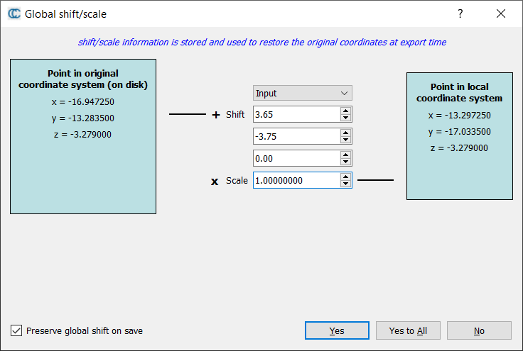

This should result in a situation as shown in Figure 5

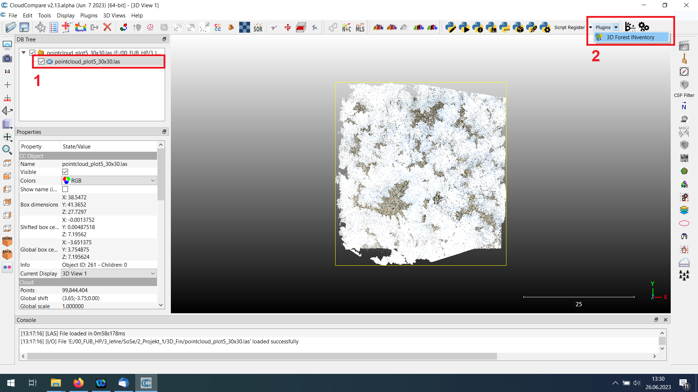

If you want to adjust some basic visualization settings of the point cloud you can get some first indications on how to achieve this in the following tutorial:

[Basic CloudCompare tutorial](https://github.com/fabianfassnacht/CloudCompare_Basics_1/blob/main/1_cloud_compare_basics.md)

However, given that our example dataset comes with some RGB information, the standard visualization setting should already be quite acceptable.

We will now start the 3D Fin plugin by first selecting the loaded point-cloud in the DB Tree window (marked with 1 in Figure 5) and then click the drop-down menu "Plugins" and select "3D Forest Inventories" (marked with 2 in Figure 5).

This will open the 3D Fin plugin and its main window as shown in Figure 6.

### Running the 3D Fin workflow in the Basic mode

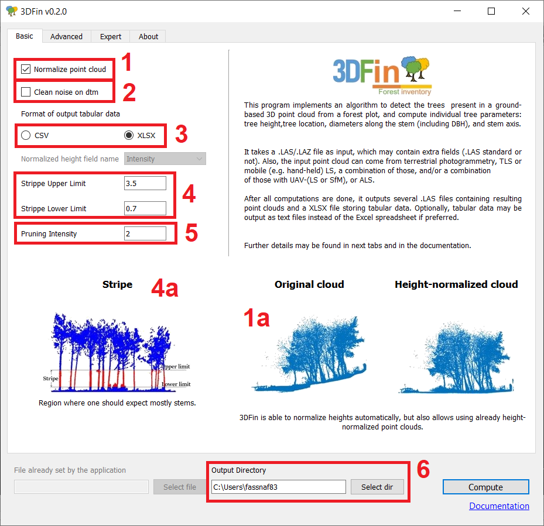

In the Basic Mode only a few parameters have to be defined by the user. These include:

- **Normalization of the point cloud** (marked with 1 in Fig. 6): If the input dataset contains a normalized point cloud (z-values of the 3D points represent the height above ground) you can uncheck this box. If your point cloud is not normalized (z-values of your 3D points represent heights above sea-level) this box should be checked and 3D Fin will automatically calculate a digital terrain model and subtract the terrain model value from the z-value of each point.
- **Clean noise on dtm** (marked with 2 in Fig. 6): In some point clouds (particularly those created using photogrammetric approaches) a certain level of noise can be expected. In such cases, some points may be located below the interpolated digital terrain model (DTM). By checking this box, you tell 3D Fin that it is ok to filter out such points during the calculation of the DTM.
- **Format of output tabular data** (marked with 3 in Fig. 6): The 3D fin processing chain will create some tables including detailed information on the identified tree stems as key outputs. Here you can define whether you prefer to have these tables saved as CSV of Excel file.
- **Strippe Upper Limit** (marked with 4 in Fig. 6): As further explained below, the first step in the 3D Fin work-flow bases on the identification of straight tree segments in the lower part of the forest stand. The idea for the two stripe parameters is to define a height range in which the trees are expected to be comparably straight and clearly visible. That is, understory elements (shrubs, herbs, grasses) should in ideal case be comparably sparse. You can define the upper and lower limit of this range depending on the situation of the understory and the trees in your forest. A graphical example is provided to further clarify the idea (see graph marked with 4a in Fig. 6)
- **Strippe Lower Limit** (marked with 4 in Fig. 6): See Strippe Upper Limit.
- **Pruning Intensity** (marked with 5 in Fig. 6): During this step, points that are close to the tree trunk segments but belong to other tree elements (such as branches and leaves) are iteratively deleted. Depending on how many of such other elements exist, you can adjust the numbers of iterations and thereby the intensity with which the algorithms tries to identify and drop such features.
- **Output Directory** (marked with 6 in Fig. 6): Define the output directory to where you want to save the outputs created by the 3D Fin work-flow.

We will now run the 3D Fin workflow for our dataset. For the general settings we **check** the "**Normalize Point Cloud**" box since our example dataset does not contain a normalized point cloud.

Because our dataset was calculated with a terrestrial laserscanner, we do not expect a lot of noise and hence leave the "**Clean noise on dtm**" **unchecked**.

As **tabular output data**, we select "**XLSX**".

Exploring our dataset visually, we can that we do not have a pronounced understory and that most of the tree trunks have comparably sparse branching structures in the lower parts of the tree trunk. Since some smaller understory elements exist with a height of more or less 1 m, we can for example set the **lower and higher stripe limit to 1.5 and 4.5 m, respectively**.

For the **pruning intensity** we keep the original setting of **2 iterations** which means that we expect low to intermediate branching (which matches our visual impression).

We finally define an "**output directory**" and then press "**Compute**" to run the 3D Fin workflow. 

You will be continuously updated on the progress in the console window at the bottom of the CloudCompare user interface (marked in Fig. 7).

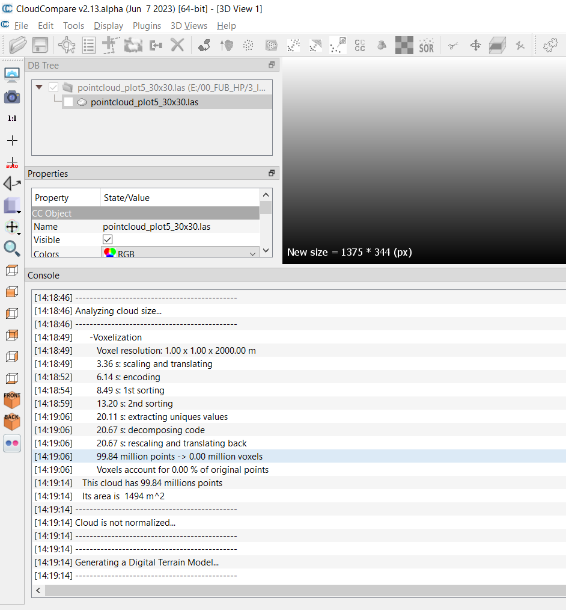

The duration to run the whole process of identifying and segmenting the tree trunks can take anything from a few seconds up to several minutes or even hours depending on the size of the applied dataset, the user-defined settings and the applied hardware. With the example dataset used in this Tutorial the processing takes approximately 10-20 min with a laptop with good (but not top-notch) performance (for example with my laptop with an i7 CPU and 16 GB RAM it takes around 14 minutes).

### Understanding the 3D Fin workflow outputs

Once the work-flow as terminated, you will see some new outputs in the CloudCompare DB tree window as shown in Figure 8 (marked with 1). By default, three of the in total 7 output files are visualized in the main visualization window of CloudCompare (Fig. 8 - marked with 2). These include the fitted tree circular tree rings, the diameter at breast height and the tree height.

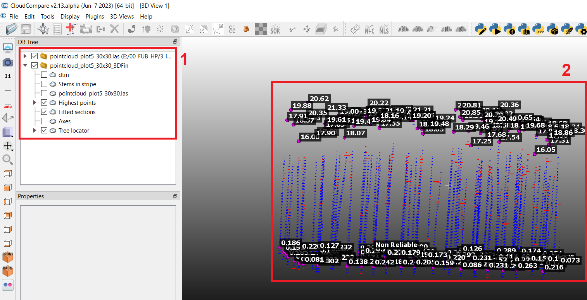

In the following we will have a look at each of the outputs individually which is helpful to better understand how the 3DFin work-flow works. 

The first step in work-flow is to normalize the pointcloud and derive a digital terrain model (DTM). Figure 9 shows the visualization of the DTM of the example dataset as represented by a point cloud of the ground points.

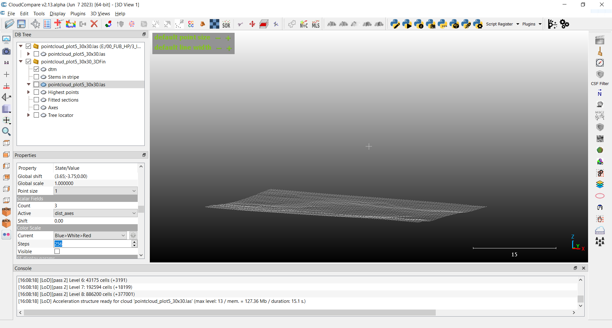

In figure 10, we can see the identified tree segments from the second step of the 3DFin work-flow during which point-cloud patterns showing a vertical continuity are identified in the user-defined height range (see stripe range setting above). In our case, all of these tree segments will be displayed for the height between 1.5 m and 4.5 m.

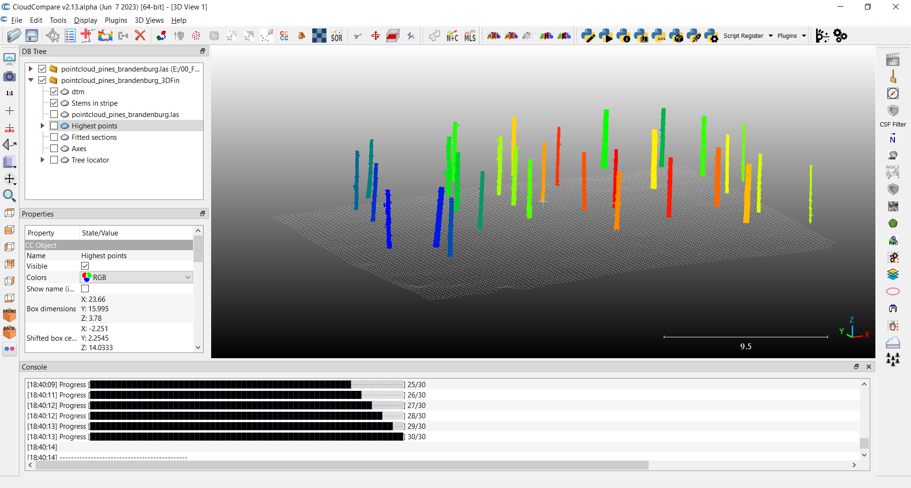

As next step in the workflow an axis is fitted through each of the tree segments shown in Figure 10. These axes are then used as orientation for the circle-fitting algorithm. That is, along this axes, the algorithm will search for circular shapes, representing points reflected by the tree stem, within a circular (optionally user-defined) buffer around the axis.  This step will repeated in regular (optionally user-defined) height intervals. The axes for our example dataset are shown in Figure 11 and the respective circle fitting output is shown in Figure 12.

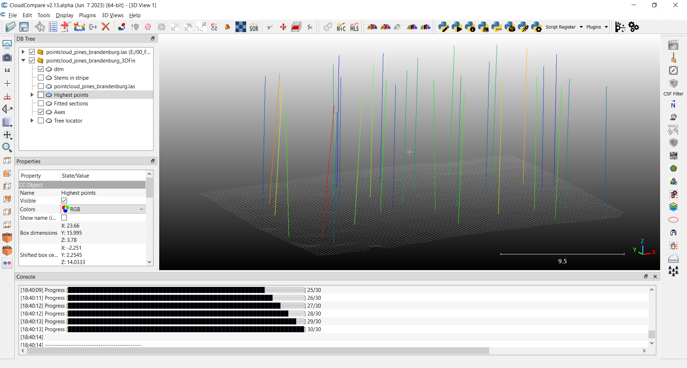

The axes (in Figure 11) are color-coded according to their tilting angle and you can see that axes that show a somewhat unexpected orientation (that is, deviating notably from the expected vertical orientation of a tree stem) are shown in red. This is not necessarily an indicator for wrongly identfied tree stems as trees sometimes are leaning but it might be a good idea to visually re-check such trees.

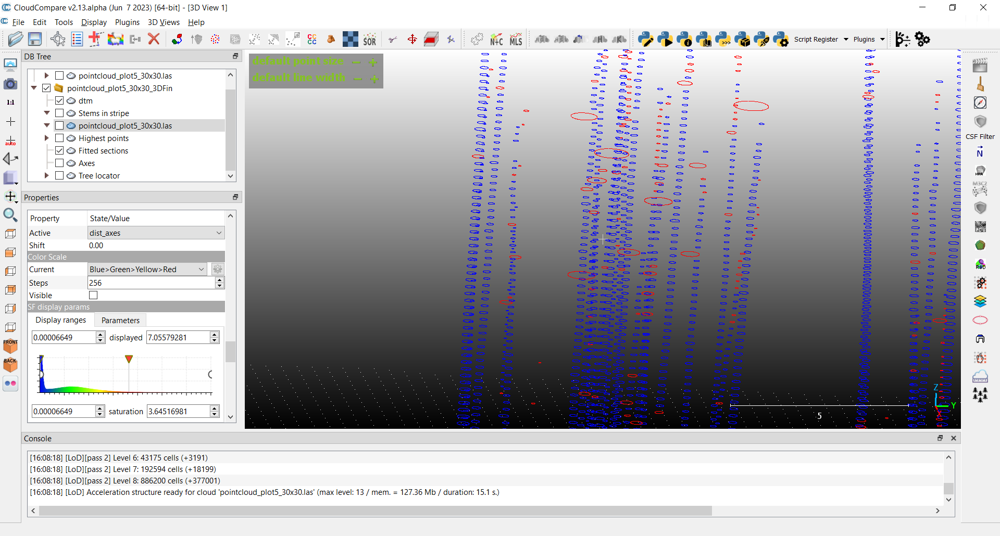

Similarly, fitted circles that show unexpected dimensions (for example a notably larger radius than the circle below) are displayed in red. In this case, most of the time the problematic circles should not be considered during subsequent processing step since it is actually quite rare that a tree will increase its diameter (notably) with height. This circle fitting quality information is also stored in the tabular output data that we will discuss further below in the Tutorial.

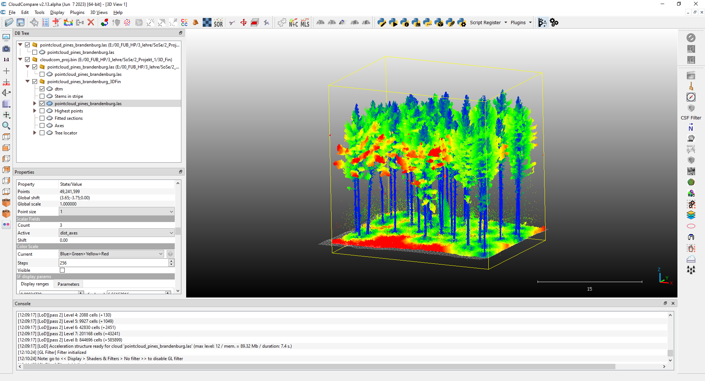

In Figure 13 you can see the original point cloud using the distance to the stem axes (as shown in Figure 11) as color-coding. In this example this means that points shown in blue are very close to the stem axes while points shown in red are more distant from the stem axes. This is a quite helpful illustration to check how successful the work-flow was in correctly identifying points belonging to tree trunks. In our example, the workflow has performed very well and only a few trunks on the edge of the plot were not detected and most of these trunks seem to be incomplete due to the edge-effects in the pointcloud.

In Figure 14 the height of each detected tree is displayed. The height is defined as the height of the highest non-isolated point in a circular region around the axes (Figure 11).

Finally, in Figure 15, the diameter at breast height (DBH) of each tree is shown. The diameter at breast height is interpolated from the diameters of the fitted circles (Figure 12) above and below the height of 1.3 m for the 1.3 m height position where the DBH is typically measured in the field. In case there are no high-quality fitted circles available within a certain range above and below the 1.3 m position, the workflow will report a "non-reliable" instead of a diameter estimate.

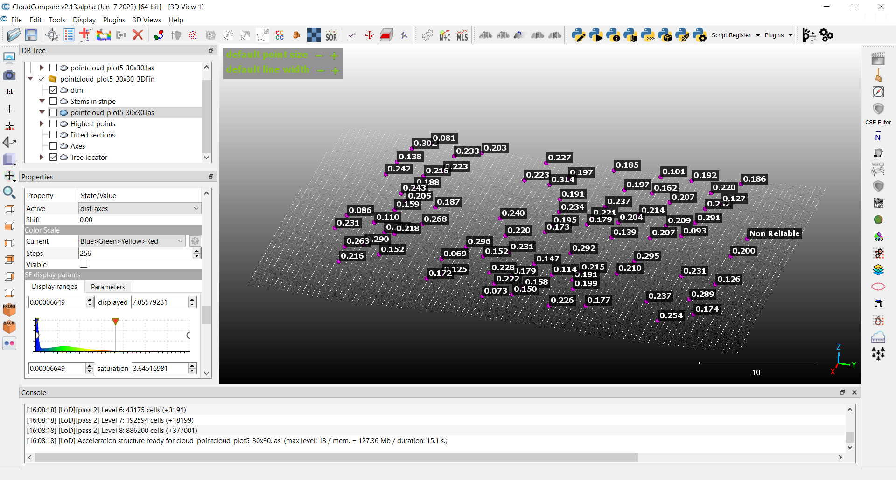

### Tabular output data

### Additional options in the Advanced mode
