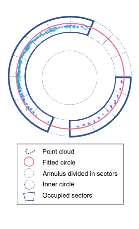

# Getting started with 3DFin to extract individual tree information from terrestrial point clouds

### Objectives of tutorial

- to understand the basic concepts behind the 3DFin workflow
- learn how to apply the 3DFin software to extract individual trees from a 3D point-cloud
- understand what the outputs of the 3DFin workflow mean

### Requirements to run this tutorial

To run this tutorial you will need a recent version of CloudCompare including the 3DFin plug-in. You can download a zip-file containing a running version for Windows here:

You will furthermore need an example dataset. In our case we will use a terrestrial laserscan (TLS) from a pine stand (*Pinus sylvestris*) in a forest in Brandenburg, Germany.

The dataset can be downloaded here:

[TLS dataset used in this tutorial](https://drive.google.com/file/d/1Uy8tpSwqWlodZ2mV2m-39gDlADxczayz/view?usp=sharing)

### Starting 3DFin in CloudCompare

**Download the zip-folder, unpack it onto a folder** on your computer which you are able to find again and then **run CloudCompare by double-blicking the "CloudCompare.exe"** in the main file folder.

This should lead to a situation as shown in Figure 1.

Figure 1: CloudCompare with 3DFin extension installed.

Your actual view is likely to appear a bit different since you might have other and additional toolbars activated. You might have to press on a little arrow-button on the top right of the menu bar to be able to see the relevant icons which are marked in Figure 1.

We are now ready to open our example dataset and start working with the 3DFin plugin. To open the dataset, we select **File => Open**  (Figure 2) and then in the appearing new window browse to the ***pointcloud_pines_brandenburg.las*** file, select it and press **"Open"**.

Figure 2: Open the example dataset

In the then appearing dialogue we use the standard settings to open the file. That is, in the first window we press **"Apply All"** (Figure 3) and in the second window **"Yes to All"** (Figure 4).

Figure 3: The open dataset dialogue in CloudCompare 1/2

Figure 4: The open dataset dialogue in CloudCompare 2/2

This should result in a situation as shown in Figure 5

Figure 5: CloudCompare view after loading the example dataset

If you want to adjust some basic visualization settings of the point cloud you can get some first indications on how to achieve this in the following tutorial:

[Basic CloudCompare tutorial](https://github.com/fabianfassnacht/CloudCompare_Basics_1/blob/main/1_cloud_compare_basics.md)

However, given that our example dataset comes with some RGB information, the standard visualization setting should already be quite acceptable.

We will now start the 3DFin plugin by first selecting the loaded point-cloud in the DB Tree window of Cloud Compare (marked with 1 in Figure 5) and then click the drop-down menu "Plugins" and select "3D Forest Inventories" (marked with 2 in Figure 5).

This will open the 3DFin plugin and its main window as shown in Figure 6.

### Running the 3DFin workflow in the Basic mode

Figure 6: The 3DFin user interface in CloudCompare

The basic mode provides only a few fundamental parameters that can be modified if required. However, the default parameters should give decent results for most datasets. In the following, a brief explanation of each parameter is provided:

- **Normalization of the point cloud** (marked with 1 in Fig. 6): If the input dataset contains a normalized point cloud (z-values of the 3D points represent the height above ground) you can uncheck this box. You will then have to provide additional information which scalar-field in your las-file contains the z-value. If your point cloud is not normalized (z-values of your 3D points represent heights above sea-level) this box should be checked and 3DFin will automatically calculate a digital terrain model and subtract the terrain model value from the z-value of each point.
- **Clean noise on dtm** (marked with 2 in Fig. 6): In some point clouds (particularly those created using photogrammetric approaches) a certain level of noise can be expected. In such cases, some points may be located below the actual ground surface which can lead to suboptimal interpolated digital terrain models (DTM) if they are not filtered out. By checking this box, you tell 3DFin that it is ok to filter out such points during the calculation of the DTM. You should use this setting particularly if you assume that your point cloud is noisy. Activating this option may lead to increased processing time.
- **Format of output tabular data** (marked with 3 in Fig. 6): The 3DFin processing chain will create some tables including detailed information on the identified tree stems as key outputs. Here you can define whether you prefer to have these tables saved as CSV or an Excel file.
- **Stripe Upper Limit** (marked with 4 in Fig. 6): As further explained below, the first step in the 3DFin work-flow bases on the identification of tree segments in the lower part of the forest stand. The idea for the two stripe parameters is to define a height range (referring to the height above ground) in which the trees stems are expected to be clearly visible. That is, understory elements (shrubs, herbs, grasses) and branches should **in ideal case** not be very dense and particularly they should not directly "connect" neighboring tree stems (that is, there should be as few as possible situation where connected point clouds reach from one tree stem to a neighboring tree stem). However, as explained below, 3DFin is also able to clean possible understorey and/or branches that could be present in the defined height range/stripe. You can define the upper and lower limit of the height range/stripe depending on the situation of the understory and the trees in your forest. A graphical example is provided to further clarify the idea (see graph marked with 4a in Fig. 6). Note that the height range/stripe defined by the upper and lower limit of the stripe ***should not be too small*** since very short tree segments increase the risk that the orientation of the segment is less representative for the orientation of the whole stem (see explanations with respect to stem axes below and Fig. 11) which is derived from the segments identified in this height range/stripe.
- **Stripe Lower Limit** (marked with 4 in Fig. 6): See Stripe Upper Limit.
- **Pruning Intensity** (marked with 5 in Fig. 6): During this step, points that are connected to the tree stems but belong to other tree elements (such as branches, leaves and/or understory) are iteratively deleted. Depending on how many of such other elements exist, you can adjust the numbers of iterations and thereby the intensity with which the algorithms tries to identify and drop such features. A value of 2 is recommended for most situations. Although in very clean forest plots and/or point clouds that are not noisy values of 0 (no pruning) or 1 could be used to reduce processing time. Higher values are preferable in cases where the trees have a large number of low branches, dense understory or in especially noisy point clouds. However, applying higher pruning intensities may lead to the elimination of stem fractions which were covered with low number of points. Note that pruning is performed twice: first during the stem identification within the stripe, and later during the whole stem extraction (some more details will be provided below).
- **Output Directory** (marked with 6 in Fig. 6): Define the output directory to where you want to save the outputs created by the 3DFin work-flow.

We will now run the 3DFin workflow for our dataset. For the general settings we **check** the "**Normalize Point Cloud**" box since our example dataset does not contain a normalized point cloud.

Because our dataset was calculated with a terrestrial laserscanner, we do not expect a lot of noise and hence leave the "**Clean noise on dtm**" **unchecked**.

As **tabular output data**, we select "**XLSX**".

Exploring our dataset visually, we can see that we do not have a pronounced understory and that most of the tree trunks have comparably sparse branching structures in the lower parts of the tree trunk. Since some smaller understory elements (maybe herbs) which reach a maximal height of 1 m, we can for example set the **lower and higher stripe limit to 1.5 and 4.5 m, respectively**.

For the **pruning intensity** we keep the original setting of **2 iterations** which means that we expect low to intermediate branching (which matches our visual impression).

We finally define an "**output directory**" and then press "**Compute**" to run the 3DFin workflow. 

You will be continuously updated on the progress in the console window at the bottom of the CloudCompare user interface (marked in Fig. 7).

Figure 7: Progress of the 3DFin work-flow in the console window

The duration to run the whole process of identifying and segmenting the tree trunks can take anything from a few seconds up to several minutes depending on the size of the applied dataset, the user-defined settings and the applied hardware. Typically, very long processing times (several hours) are not expected since the process is limited by the available memory and too large datasets cannot be processed in the current version. With the example dataset used in this Tutorial the processing takes approximately 5-10 min with a laptop with good (but not top-notch) performance (for example with my laptop with an i7 CPU and 16 GB RAM it takes around 7-8 minutes).

### Understanding the 3D Fin workflow outputs

Once the work-flow as terminated, you will see some new outputs in the CloudCompare DB tree window as shown in Figure 8 (marked with 1). By default, three of the in total 7 output files are visualized in the main visualization window of CloudCompare (Fig. 8 - marked with 2). These include the fitted stem section circular tree rings, the diameter at breast height and the tree height.

Figure 8: Outputs of the 3DFin work-flow

In the following we will have a look at each of the outputs individually which is helpful to understand how the 3DFin work-flow works. 

The first step in work-flow is to normalize the pointcloud and derive a digital terrain model (DTM). Figure 9 shows the visualization of the DTM of the example dataset as represented by a point cloud of the ground points. In this case the extracted DTM looks quite plausible. There might be other situation where the automatically derived DTM is not of sufficient quality. We will have a look at this issue in one of the exercises provided as supplement to this tutorial.

Figure 9: DTM derived in the 3DFin work-flow

In figure 10, we can see the identified tree segments from the second step of the 3DFin work-flow during which point-cloud patterns showing a vertical continuity are identified in the user-defined height range (see stripe range setting above). In our case, all of these tree segments will be displayed for the height between 1.5 m and 4.5 m.

Figure 10: Tree segments identified by the 3DFin workflow

As next step in the workflow an axis is fitted through the centers of the tree section discs shown in Figure 10. This step is accomplished by deriving the 1st axis of a Principal Component Analysis using the 3D-positions of the identified tree stem section centers as input. These fitted axes are then used as orientation for the circle-fitting algorithm. That is, along this axes, the algorithm will search for circular shapes, representing points reflected by the tree stem, within a circular buffer with a (optionally user-defined) fixed radius around the axis.  This step will repeated in regular (optionally user-defined) height intervals. The axes for our example dataset are shown in Figure 11 and the respective circle fitting output is shown in Figure 12.

Figure 11: Axes fitted from the tree stem segments

The axes (in Figure 11) are color-coded according to their tilting angle and you can see that axes that show a higher tilting relative to the other trees (that is, deviating notably from the average vertical orientation of a tree stems in the dataset) are shown in red. This is not necessarily an indicator for wrongly identfied tree stems as trees sometimes are leaning but it might be a good idea to visually re-examine such trees by comparing the identified stem sections with the point cloud.

Figure 12: Circles fitted around the expected tree trunk as guided by the axes shown in Fig. 11.

Similarly, fitted circles that show unexpected dimensions (for example a notably larger radius than the circle below) or locations are displayed in red. Most of the time these problematic circles should not be considered during subsequent processing step since it is actually quite rare that for example a tree will increase its diameter (notably) with height or that the stem shape deviates notably from a vertically continuous cylinder-like form. Some information related to the circle fitting quality is also stored in the tabular output data that we will discuss further below in the Tutorial.

Figure 13: Distance axes.

In Figure 13 you can see the original point cloud with point colors relating to the distance to the stem axes (as shown in Figure 11). In this example this means that points shown in blue are very close to an identified stem axis while points shown in red are more distant from all stem axes. This is a quite helpful illustration to check how successful the work-flow was in correctly identifying points belonging to tree trunks. In our example, the workflow has performed very well.

In Figure 14 the height of each detected tree is displayed. The height is defined as the height of the highest non-isolated point in a cylindrical region around the axes (Figure 11).

Figure 14: Tree height.

Finally, in Figure 15, the diameter at breast height (DBH) of each tree is shown. The diameter at breast height is interpolated from the diameters of the fitted circles (Figure 12) above and below the DBH height of 1.3. In case there are no high-quality fitted circles available within a certain range above and below the 1.3 m position, the workflow will set the DBH of this tree to "non-reliable" instead of providing a diameter estimate.

Figure 15: Tree DBH.

We now have had a look at all outputs of the 3DFin workflow within CloudCompare. If you want to keep a copy of these files, you have the option to save the CloudCompare project into a "Cloud Compare Entities" binary file by selecting all the files in the DB Tree window and then select **"File -> Save"** (Fig. 16). Select **"Cloud Compare Entities"** as file format and then browse to a folder where you want to save the project and click **"Save"**. You should now be able to re-load your current state with all files the next time you open CloudCompare by simply selecting **"File -> Open"** and then browse to the folder where you stored the file.

Figure 16: Tree DBH.

We have now completed the basic 3DFin workflow in CloudCompare and will have a closer look at the tabular output data created by the workflow. This tabular output data is the main output which you will most likely want to use as inputs to additional processing-algorithms or as final results.

### Tabular output data

As first step, browse to the output folder which you defined in the CloudCompare work-flow window before starting the computations. Then open the Excel-File that was created as output of the workflow. You should see a situation as shown in Figure 17.

Figure 17: Output Excel file.

As you can see there are in total 9 separate sheets (marked with 1 in Figure 17) that contain all relevant results created by the 3DFin work-flow. In the following we will briefly explain the contents of each sheet.

*Plot Metrics*
On the first sheet called "Plot Metrics" you find the total height (TH), the diameter at breast height (DBH) as well as the x-position (X) and y-position (Y) of each tree (T) identified in the point cloud (marked with 2 and 3 in Figure 17). In our example 30 trees were identified

*Diameters*
In the diameters sheet you can find diameter of all stem section (columns) of all trees (rows) (Figure 18). The number of stem sections varies based on the height of the trees and you will see that as a consequence typically all trees will have several fields with 0 diameter in some higher stem section columns in the table.

Figure 18: Diameter sheet.

*X*
The X sheet contains the x-coordinates of the center points of all stem sections (columns) of all trees (rows) (Figure 19)

Figure 19: X sheet.

*Y*
The Y sheet contains the y-coordinates of the center points of all stem sections (columns) of all trees (rows)

*Sections*
The Sections sheet shows the heights for which stem sections were determined (Figure 20). These values depend on the user-defined lowest section height and the selected height-interval. These values are the same for all trees an are hence only displayed once.

Figure 20: Sections sheet.

*Quality sheets*
The next four sheets contain information on the quality of each stem section. The first of the four quality sheets named *Q(Overall Quality 0-1)* is a binary summary of the other three quality sheet named *Q1(Outlier Probability)*, *Q2(Sector Occupancy)* and *Q3(Points Inner Circle)*

**add explanation how binary layer is created**

The  *Q1(Outlier Probability)* sheet contains a number for each stem segment of each trees  which indicates how likely it is that an identified segment is actually not part of the tree stem (as represented by all other tree segments of the same tree) (Figure 21).  The higher the value, the more likely that the given section is an outlier. 

Figure 21: Outlier Probability.

This indicator value bases on a calculation which is illustrated in Figure 22. To derive the indicator value, the inclination-angle the center of a given stem section disc with the centers of all other stem sections is calculated (see for example Tree A section 1 in Figure 22). Then, all of these inclination angles are summarized into one value. This step is then repeated for all stem section discs. 

As shown in Figure 22, the inclination angles (symbolized by the arrows) of the visualized stem sections of Tree A (Section 1,2,3,7) are all very comparable and hence the indicator would not identify an outlier here. An important property of this approach as compared to a simpler approach (for example simply checking for deviations from a straight standing cylinder) is that it also suitable for leaning stems (which can occur in forests quite frequently).

Figure 22: Outlier indicator.

For Tree B - which contains a quite clear outlier stem section - we can see that for sections 1, 2 and 7, most of the arrows are still showing very comparable directions with only the arrow heading towards the outlier section showing a notably different angle. However, when we have a look at the arrows for the fifth segment from the bottom, we can see that the directions of the arrows are strongly variable for the outlier section which would then also be detected as an outlier by the indicator value. 

The second quality indicator named *Q2(Sector Occupancy)* indicates whether for a given stem section, points were available around the complete stem disc ring. To assess this, the stem section ring is split up into equally sized sectors (default values are 16 sectors of 22.5°) and the algorithm checks how many of these segments contain points and stores the corresponding value as percentage (Figure 23).

Figure 23: Sector occupancy.

The values given in the Excel sheet represent the percentage of sections containing points (Figure 24).

Figure 24: Sector occupancy sheet.

Finally, the last quality indicator *Q3(Points Inner Circle)* is the number of points within an inner circle within the stem section ring. This inner ring is calculated based on the fitted stem section ring by creating a concentrical circle with half the diameter of the fitted circle as default value. Then, all the points in that section that fall within that inner circle are counted.

It is important to understand that in this case, the higher the number of points within the ring, the lower the probability that the stem section was correctly identified as the assumption is that you cannot have points reflected from within the tree stem (but only from the outside, the bark of the tree).  As you can see in Figure 25, we observe a value of 0 for most tree stem sections in the Excel sheet.

Figure 25: Point within circle.

### Additional options in the Advanced mode

With the information provided above you should now be able handle the 3DFin workflow using the basic settings quite well. For comparably easy forest stands (that is homogeneous stands with little understorey and branching in the lower stem parts) and high quality laserscanning data you should be able to obtain reasonable results using only these basic settings.

However, in some cases, you might not reach a completely satisfying result with these settings alone, or may want to reduce the processing time. In those cases, the advanced parameters in the second tab of the graphical user interface of the 3DFin workflow provide some additional options to adapt the workflow parameters (Figure 26).

Figure 26: Advanced Parameter settings.

You can adapt 6 settings in total and all of these settings relate to the 3rd part of the 3DFin workflow in which the stem section discs are being identified. In the following we will provide a brief explanation of each of these settings:

- **Expected maximum diameter:** As its name states, the user may provide the program with an estimate (in meters) of what is the maximum diameter expected for any stem. This value will be used to discard objects that have very large diameters which are unlikely to be trees at the given site.
- **Stem search diameter:** This parameter defines the area that will be analyzed around each tree axis during the stem extraction. All points falling in a cylinder around the identified stem axes (Fig. 11) with the diameter defined here will be considered during the circle fitting to identify potential stem section discs. Even if there is an expected maximum diameter for trees of for example 1 m, a larger margin helps the algorithm to discern the stem disc from its surrounding. This is especially useful when the stems are clearly not straight.
- **Lowest section:** This parameter defines at which height above the ground the identification of tree sections should be started. The units are in meters.
- **Highest section:** This parameter defines the height of the highest section. It must be a value larger than the lowest section and should be set to a realistic value based on the user's knowledge of the forest. Since the increase of the value for the highest section is hardly affecting the processing time - in doubt - it is recommended to rather chose a higher value.
- **Distance between sections:**  This parameter defines the interval at which sections will be computed among the lowest and highest ones.
- **Section width / thickness:** This parameter defines the vertical range of each section for which the algorithm selects the points for fitting the stem section ring.  Note that this value is added to each side of the section, which makes the effective section width double the input value: i.e., if a section’s starting height is 1 m and the section width is 0.05 m, then the points regarded as belonging to that section (and hence available for the circly fitting) are those with height values within [0.975-1.025] m range.
